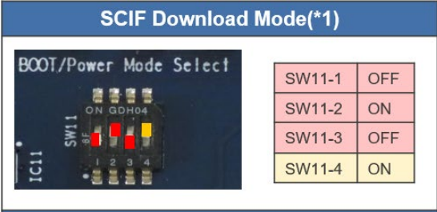
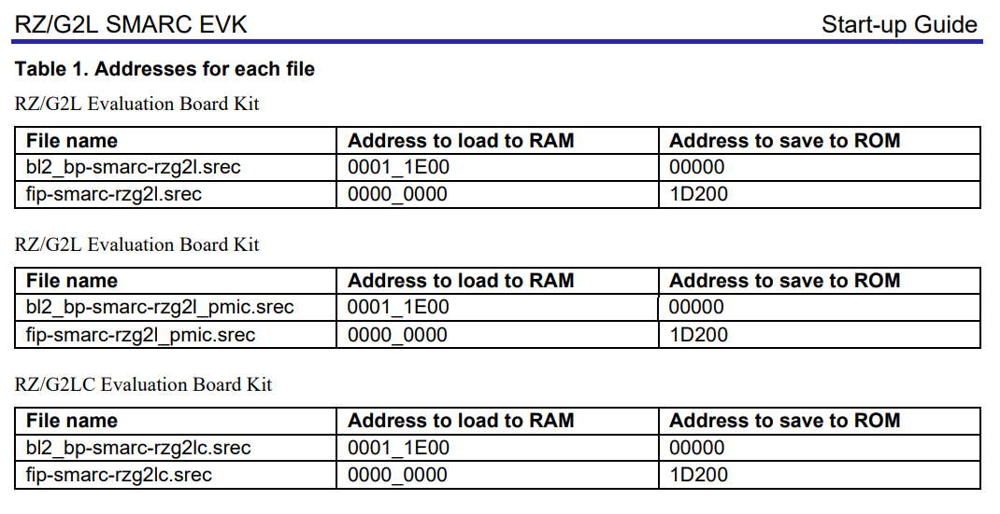
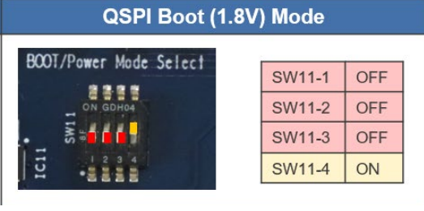
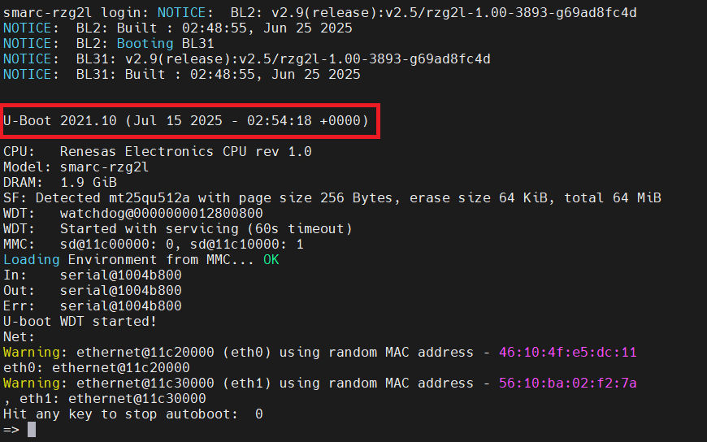

# Flashing the bootloader

## Inputs

Let's take G2L bootloader from the Yocto build directory

There are 2 types of G2L SoCs: **PMIC** and **non-PMIC**

RZ/G2L Evaluation Board Kit **non-PMIC version**:

- Flash_Writer_SCIF_RZG2L_SMARC_DDR4_2GB.mot (flash writer)
- bl2_bp-smarc-rzg2l.srec (boot loader)
- fip-smarc-rzg2l.srec (boot loader)

RZ/G2L Evaluation Board Kit **PMIC version**:

- Flash_Writer_SCIF_RZG2L_SMARC_PMIC_DDR4_2GB_1PCS.mot (flash writer)
- bl2_bp-smarc-rzg2l_pmic.srec (boot loader)
- fip-smarc-rzg2l_pmic.srec (boot loader)


## Boot mode switches

Configure **SW11** to flash bootloader like below
<div align="center" markdown="1">



</div>

## Flashing
**1.Flash_Writer**
```
SCIF Download mode 
(C) Renesas Electronics Corp.
-- Load Program to SystemRAM ---------------
please send !
```
File -> Sendfile (**Flash_Writer_SCIF_RZG2L_SMARC_PMIC_DDR4_2GB_1PCS.mot**)

**2.BL2**
```
>XLS2
===== Qspi writing of RZ/G2 Board Command =============
Load Program to Spiflash
Writes to any of SPI address.
Micron : MT25QU512
Program Top Address & Qspi Save Address
===== Please Input Program Top Address ============
 Please Input : H'11E00
===== Please Input Qspi Save Address ===
 Please Input : H'00000
Work RAM(H'50000000-H'53FFFFFF) Clear....
please send ! ('.' & CR stop load)
```
File -> Sendfile (**bl2_bp-smarc-rzg2l_pmic.srec**)
**3.TFA**
```
>XLS2
===== Qspi writing of RZ/G2 Board Command =============
Load Program to Spiflash
Writes to any of SPI address.
Micron : MT25QU512
Program Top Address & Qspi Save Address
===== Please Input Program Top Address ============
 Please Input : H'00000
===== Please Input Qspi Save Address ===
 Please Input : H'1D200
Work RAM(H'50000000-H'53FFFFFF) Clear....
please send ! ('.' & CR stop load)
```
File -> Sendfile (**fip-smarc-rzg2l_pmic.srec**)
<div align="center" markdown="1">



</div>

## Boot

Now all bootloader files are loaded => Change SW11 to normal boot and reboot the
board. You should see something like

<div align="center" markdown="1">





</div>
