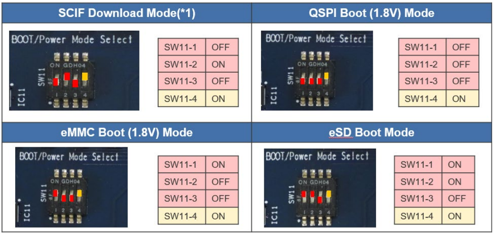

# Boot modes & flashing

## Inputs

Let's take G2L bootloader from the Yocto build directory

There are 2 types of G2L SoCs: **PMIC** and **non-PMIC**

RZ/G2L Evaluation Board Kit **non-PMIC version**:

- Flash_Writer_SCIF_RZG2L_SMARC_DDR4_2GB.mot (flash writer)
- bl2_bp-smarc-rzg2l.srec (boot loader)
- fip-smarc-rzg2l.srec (boot loader)

RZ/G2L Evaluation Board Kit **PMIC version**:

- Flash_Writer_SCIF_RZG2L_SMARC_PMIC_DDR4_2GB_1PCS.mot (flash writer)
- bl2_bp-smarc-rzg2l_pmic.srec (boot loader)
- fip-smarc-rzg2l_pmic.srec (boot loader)


## Boot mode switches

Configure **SW11** to flash bootloader like below




`SW1` on the SoM selects the boot source (see the SMARC EVK user manual for the
exact bit pattern of your board revision):

| Mode          | Use                                       |
| ------------- | ----------------------------------------- |
| eSD           | boot from microSD on the carrier          |
| eMMC          | boot from on-module eMMC                  |
| QSPI          | boot from serial NOR (factory default)    |
| SCIF download | UART boot — used to flash the bootloaders |

## Boot chain

```
BootROM → bl2 (TF-A) → fip (bl31 + U-Boot) → Linux kernel + DTB
```

## Flashing the bootloader (SCIF download mode)

1. Set `SW1` to **SCIF download**, power-cycle.
2. Send the `Flash_Writer_SCIF_*.mot` binary via the serial terminal
   (ASCII / plain text send).
3. At the `>` prompt:

```text
>XLS2
===== Please Input Program Top Address ============
Please Input : H'11E00
===== Please Input Qspi Save Address ===
Please Input : H'00000
# send bl2_bp-smarc-rzg2l_pmic.srec

>XLS2
Please Input : H'00000
Please Input : H'1D200
# send fip-smarc-rzg2l_pmic.srec
```

4. Set `SW1` back to **QSPI**, power-cycle.

## U-Boot environment

```text
setenv bootargs 'console=ttySC0,115200 root=/dev/mmcblk1p2 rw rootwait'
setenv bootcmd 'mmc dev 1; fatload mmc 1:1 0x48080000 Image; fatload mmc 1:1 0x48000000 r9a07g044l2-smarc.dtb; booti 0x48080000 - 0x48000000'
saveenv
```
