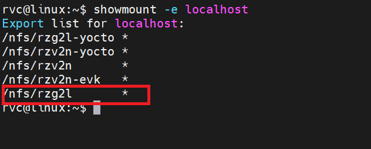
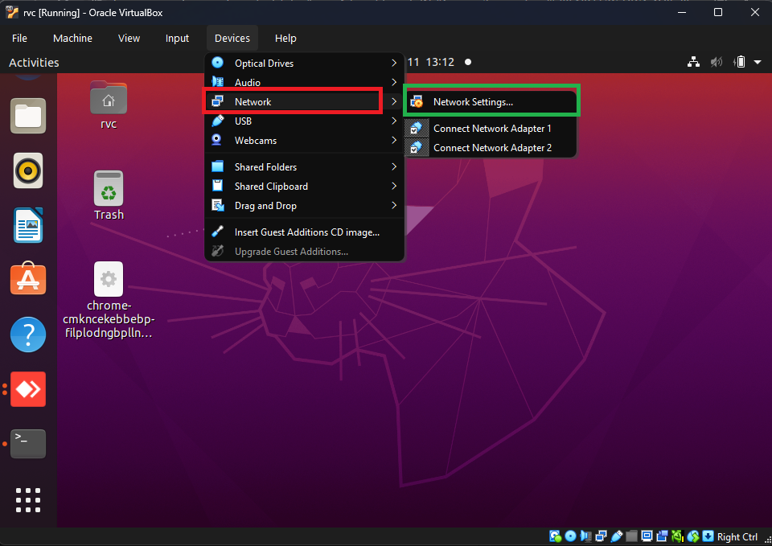
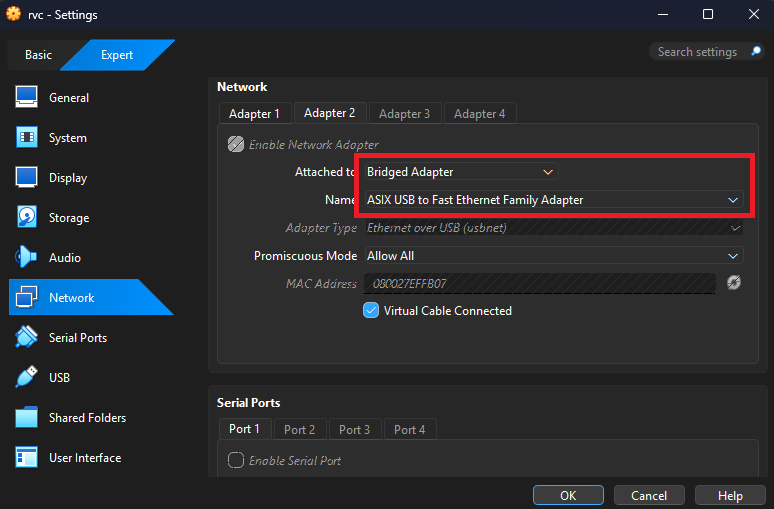
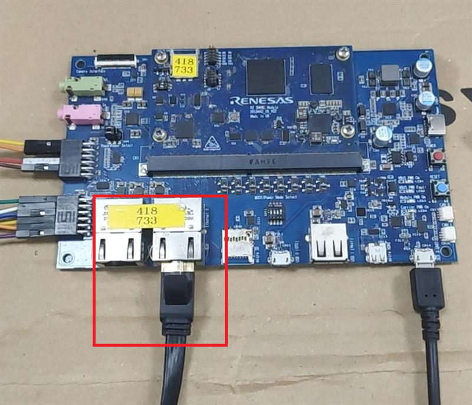

# Booting with TFTP and NFS

## Set up TFTP Server

Download and install tftp-hpa by command (`/srv/tftp/` is used for TFTP server directory)

```bash
sudo apt-get install tftpd-hpa
```

Check status of tftpd-hpa by command:
```bash
service tftpd-hpa status
```

Disable firewall by command:
```base
sudo ufw disable
```

## Set up NFS Server
Download and install NFS server by commands:

```bash
sudo apt-get install nfs-kernel-server
```

Start a NFS server:
```bash
sudo /etc/init.d/nfs-kernel-server start
```

Check status of nfs service:
```
service nfs-kernel-server status
```

Create a directory for NFS:
```
sudo mkdir -p /nfs/rzg2l
```

Open /etc/exports by text editor:
```
sudo vim /etc/exports
```

Add the following settings:
```
/nfs/rzg2l *(rw,no_subtree_check,sync,no_root_squash)
```

Force an NFS server to read /etc/exports:
```
sudo exportfs -a
```

Confirm the NFS server starts successfully:
```
showmount -e localhost
```

<div align="center" markdown="1">



</div>

## Prepare Image, DTB, RootFS

Copy `Image` and `r9a07g044l2-smarc.dtb` to `/srv/tftp/`:
```
sudo cp <Image path> <device tree path> /srv/tftp/
```

Copy rootfs (*.tar.bz2) to the mount point. In this case that is located at `/nfs/rzg2l`:
```
sudo cp <rootfs path> /nfs/rzg2l
```
Extract rootfs by command:
```
sudo tar -xvf <file_name>
```

## Set static IP

Network setting for virtual machine:

Select  Device->Network->Network Settings

<div align="center" markdown="1">



</div>

Network setting:

Config setting following the picture

<div align="center" markdown="1">



</div>

Check network interfaces on host machine by command `ifconfig`

```bash
rvc@linux:~$ ifconfig
enp0s3: flags=4163<UP,BROADCAST,RUNNING,MULTICAST>  mtu 1500
        inet 10.0.2.15  netmask 255.255.255.0  broadcast 10.0.2.255
        inet6 fd17:625c:f037:2:f9e4:4f39:455c:de85  prefixlen 64  scopeid 0x0<global>
        inet6 fd17:625c:f037:2:d69:fb94:9bcd:25a  prefixlen 64  scopeid 0x0<global>
        inet6 fe80::1b28:23b2:b5e4:b231  prefixlen 64  scopeid 0x20<link>
        ether 08:00:27:96:16:a4  txqueuelen 1000  (Ethernet)
        RX packets 478311  bytes 389572624 (389.5 MB)
        RX errors 0  dropped 0  overruns 0  frame 0
        TX packets 208008  bytes 60924331 (60.9 MB)
        TX errors 0  dropped 0 overruns 0  carrier 0  collisions 0

enx080027effb07: flags=4163<UP,BROADCAST,RUNNING,MULTICAST>  mtu 1500
        inet 192.168.1.3  netmask 255.255.255.0  broadcast 192.168.1.255
        inet6 fe80::a00:27ff:feef:fb07  prefixlen 64  scopeid 0x20<link>
        ether 08:00:27:ef:fb:07  txqueuelen 1000  (Ethernet)
        RX packets 0  bytes 0 (0.0 B)
        RX errors 0  dropped 0  overruns 0  frame 0
        TX packets 0  bytes 0 (0.0 B)
        TX errors 0  dropped 0 overruns 0  carrier 0  collisions 0

lo: flags=73<UP,LOOPBACK,RUNNING>  mtu 65536
        inet 127.0.0.1  netmask 255.0.0.0
        inet6 ::1  prefixlen 128  scopeid 0x10<host>
        loop  txqueuelen 1000  (Local Loopback)
        RX packets 165328  bytes 50240248 (50.2 MB)
        RX errors 0  dropped 0  overruns 0  frame 0
        TX packets 165328  bytes 50240248 (50.2 MB)
        TX errors 0  dropped 0 overruns 0  carrier 0  collisions 0
```

In this case I set static ip for **enx080027effb07**. 

To set static ip for **enx080027effb07** , edit setting in `/etc/network/interfaces`

Add setting below into the file: 
```
auto lo
iface lo inet loopback

iface enx080027effb07 inet static
address 192.168.1.3   # <IP>
netmask 255.255.255.0 # <netmask>
```

Restart machine to apply new setting by using command `reboot`

Setting static ip for **enx080027effb07** by command:
```
sudo ifconfig enx080027effb07 192.168.1.3
```

## Connect Host machine and device

Connect serial port and Ethernet port to host machine

<div align="center" markdown="1">



</div>

## U-boot config in device

Set MAC address:
```
setenv ethaddr 74:90:50:00:00:d6
```

Set board ip and server ip by command
```
setenv ipaddr 192.168.1.5
setenv serverip 192.168.1.3
```

Setting `bootcmd` variable to specify name of Image and device tree file.
```
setenv bootcmd 'tftp 0x48080000 Image; tftp 0x48000000 r9a07g044l2-smarc.dtb; booti 0x48080000 - 0x48000000'
```

Setting `bootars` to specify the location of rootfs
```
setenv bootargs 'console=ttySC0,115200n8 ip=192.168.1.5:192.168.1.3::::eth0 rootwait root=/dev/nfs rw nfsroot=192.168.1.3:/nfs/rzg2l,nfsvers=3,tcp noinitrd nohlt panic=1 earlyprintk=ttySC0,115200n8'
```

Save environment if you want to autoboot with the config (optional)
```
saveenv
```

Check connection by command:
```
ping 192.168.1.3 # serverip
```

Start booting by command:
```
boot
```

Expected boot logs
```
Hit any key to stop autoboot:  0
Using ethernet@11c20000 device
TFTP from server 192.168.1.3; our IP address is 192.168.1.5
Filename 'Image'.
Load address: 0x48080000
Loading: #################################################################
         #################################################################
         #################################################################
         #################################################################
         #################################################################
         #################################################################
         #################################################################
         #################################################################
         #################################################################
         #################################################################
         #################################################################
         #################################################################
         #################################################################
         #################################################################
         #################################################################
         #################################################################
         #################################################################
         #################################################################
         #################################################################
         #################################################################
         #################################################################
         #################################################################
         #################################################################
         #################################################################
         #################################################################
         #################################################################
         #################################################################
         ##############
         151.4 KiB/s
done
Bytes transferred = 25963008 (18c2a00 hex)
Using ethernet@11c20000 device
TFTP from server 192.168.1.3; our IP address is 192.168.1.5
Filename 'r9a07g044l2-smarc.dtb'.
Load address: 0x48000000
Loading: ###
         51.8 KiB/s
done
Bytes transferred = 39425 (9a01 hex)
Moving Image from 0x48080000 to 0x48200000, end=49b80000
## Flattened Device Tree blob at 48000000
   Booting using the fdt blob at 0x48000000
   Loading Device Tree to 0000000057ff3000, end 0000000057fffa00 ... OK

Starting kernel ...
```
